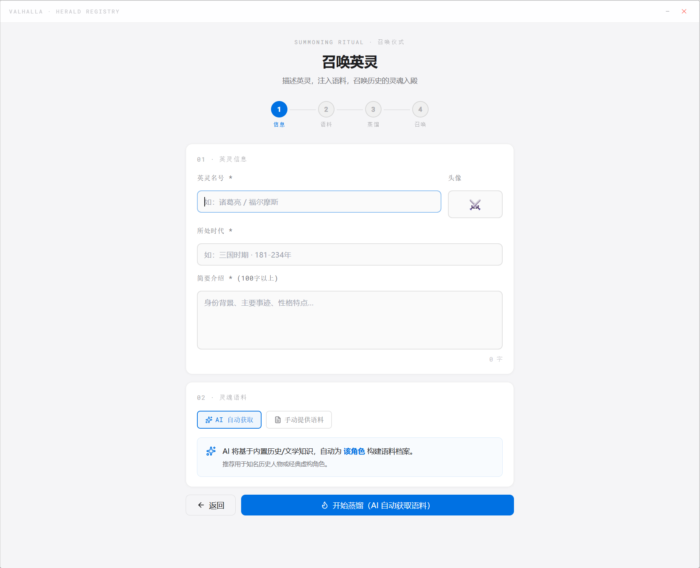

# Third Kind Contact

> Create AI companions from your own corpus, then bring them into a desktop stage.  
> 用你自己的语料创建 AI 伙伴，并把它带到桌面小舞台。



Third Kind Contact is a clean, local-first Tauri + React desktop app for building interactive AI companions. It helps users define a character, collect or paste source material, distill a structured soul profile, chat with the result, generate a pixel-style desktop sprite, and optionally create short stage videos.

Third Kind Contact 是一个纯净版、本地优先的 Tauri + React 桌面应用。它帮助用户填写角色信息、注入语料、蒸馏灵魂档案、进行长期对话、生成像素桌宠，并可选生成桌面小舞台视频。

## Why It Matters / 为什么值得关注

- **Bring your own characters**: no bundled cloned roles, no preloaded personas.
- **Local-first privacy**: API keys and created companions stay in local storage unless you export them.
- **Structured soul profiles**: the app turns messy material into traits, methods, dialogue protocols and system prompts.
- **Desktop-native experience**: Tauri gives the app a lightweight native shell and desktop companion mode.
- **Creator-ready template**: ideal for AI companion experiments, narrative tools, character prototyping and personal knowledge agents.

- **自带角色**：仓库不内置任何复刻角色或私有角色数据。
- **本地优先隐私**：API Key 与用户创建角色默认只保存在本机。
- **结构化灵魂档案**：把零散语料整理为特质、方法论、对话协议和系统提示词。
- **桌面原生体验**：基于 Tauri，支持轻量桌面窗口与桌宠模式。
- **适合二次创作**：可用于 AI 伴侣、叙事工具、角色原型、个人知识体等实验。

## Features / 功能

- Summon flow for character name, era, biography and corpus.
- AI-assisted profile distillation with DeepSeek-compatible chat APIs.
- Optional OpenAI-compatible web/search augmentation.
- Long-form chat with saved local conversation history.
- Pixel sprite generation workflow for desktop companion mode.
- Optional Seedance / Ark video generation integration for stage scenes.
- Clean public template with no API keys, no localStorage export and no cloned role payloads.

## Screenshots / 截图

More screenshots can be added under `docs/screenshots/`.

更多截图可放在 `docs/screenshots/`，README 会直接引用仓库内图片。

## Tech Stack / 技术栈

- Tauri 2
- React 19
- TypeScript
- Vite
- Tailwind CSS
- DeepSeek-compatible chat completions
- OpenAI-compatible image/search APIs
- Volcengine Ark / Seedance integration

## Quick Start / 快速开始

### Prerequisites / 前置环境

- Node.js 20+
- npm
- Rust stable
- Tauri prerequisites for your OS

### Install / 安装

```bash
git clone https://github.com/zhangtianruiwork-droid/Third-Kind-Contact.git
cd Third-Kind-Contact
npm install
```

### Run Web Dev Mode / 前端开发模式

```bash
npm run dev
```

### Run Desktop Dev Mode / 桌面开发模式

```bash
npx tauri dev
```

### Build / 构建

```bash
npm run build
npx tauri build
```

## API Setup / API 配置

Open the app settings and paste your own keys. This repository does not include any API key.

打开应用设置页，填写你自己的 API Key。本仓库不包含任何 API Key。

| Provider | Purpose |
| --- | --- |
| DeepSeek-compatible API | Soul distillation and chat |
| OpenAI-compatible API | Optional search augmentation and image generation |
| Volcengine Ark / Seedance | Optional stage video generation; the clean template ships with a safe disabled backend stub |

For local development, you may also use environment variables supported by the Tauri backend, such as `ARK_API_KEY`. Do not commit real secrets. The public clean template keeps Seedance task creation disabled in the Rust backend until you wire your own production provider implementation.

本地开发可按后端支持使用 `ARK_API_KEY` 等环境变量。不要提交真实密钥。公开纯净版的 Rust 后端默认禁用 Seedance 任务创建，需要你接入自己的生产级 provider 实现后再开放视频生成。

## Clean Template Guarantee / 纯净版说明

This public version has been cleaned before publishing:

- No bundled API keys.
- No exported localStorage seed file.
- No prebuilt or cloned character profiles.
- No private role avatars or generated sprite assets.
- No local `node_modules`, `dist`, or Tauri `target` build cache.

本公开版发布前已清理：

- 不包含 API Key。
- 不包含 localStorage 种子导出。
- 不包含预置或复刻角色档案。
- 不包含私有角色头像或已生成 sprite。
- 不包含 `node_modules`、`dist`、`src-tauri/target` 等本地构建缓存。

## Project Structure / 项目结构

```text
src/
  App.tsx                 Main app shell
  pages/                  Hall, summon, settings, sprite and scene pages
  components/             Overlays, desktop companion and UI components
  lib/                    API clients, stores, distillation and export helpers
src-tauri/
  src/lib.rs              Tauri commands and Ark / Seedance backend calls
docs/screenshots/         README screenshots
public/                   Public static assets
```

## Recommended First User Flow / 推荐首次使用流程

1. Open Settings and add your model keys.
2. Click Summon.
3. Fill in a character name, time period and biography.
4. Paste source material or let the app gather public reference material.
5. Distill the soul profile.
6. Start a conversation.
7. Optionally generate a pixel sprite and enter desktop companion mode.

## Privacy / 隐私

The app is designed around local-first storage. User-created companions, chat history and API settings are stored in the browser/Tauri local storage on the user's machine. External API calls happen only when the user triggers features that require them.

应用默认使用本地存储。用户创建的角色、对话记录和 API 设置保存在本机浏览器/Tauri 本地存储中。只有在用户主动触发需要模型能力的功能时，才会向外部 API 发起请求。

## Roadmap / 路线图

- Import/export companion packs with explicit privacy warnings.
- Better model-provider presets.
- Richer desktop stage controls.
- Multi-language onboarding.
- Automated release builds for Windows, macOS and Linux.

## Contributing / 贡献

Issues and pull requests are welcome. Please keep public examples free of private API keys, private role data and copyrighted assets that cannot be redistributed.

欢迎提交 Issue 和 PR。请确保公开示例不包含私人 API Key、私有角色数据或不可再分发的版权素材。

## License / 许可证

MIT. See [LICENSE](LICENSE).
