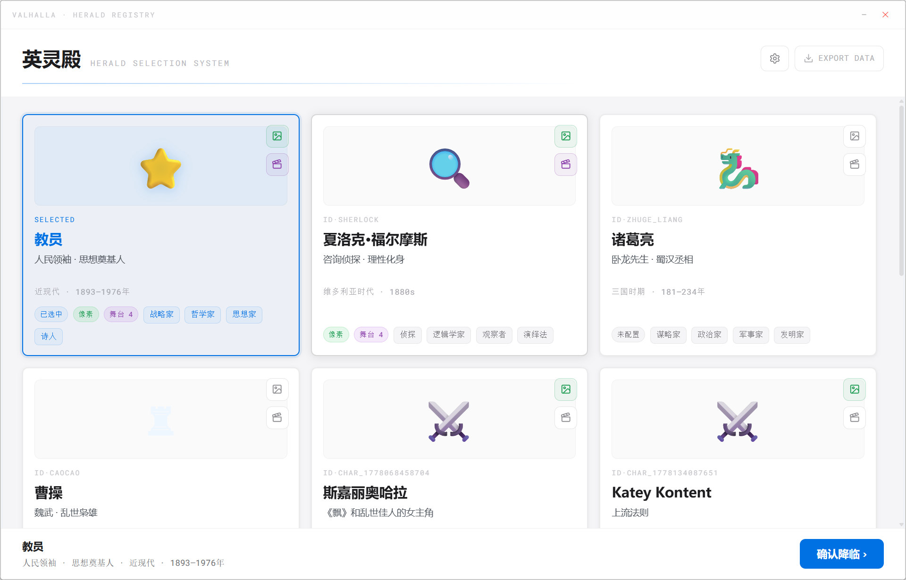

# Third Kind Contact / 英灵殿

> Original Valhalla-style desktop companion studio, published as a clean source release.  
> 保留原版英灵殿桌面伙伴工作流与界面，只移除内置人物、私有素材和密钥的公开源码版。



## English

Third Kind Contact is a Tauri + React desktop app for creating AI companions from user-provided character material. This repository keeps the original product interface and workflow: selection hall, summoning wizard, API settings, soul chat, pixel sprite generation, and desktop-stage tools.

This public release is intentionally clean:

- No bundled API keys.
- No exported localStorage seed file.
- No prebuilt or cloned character profiles.
- No private character avatars or generated role assets.
- No `node_modules`, `dist`, or Tauri `target` cache.

Users bring their own model keys and create their own companions inside the app.

## 中文

Third Kind Contact / 英灵殿 是一个基于 Tauri + React 的桌面 AI 伙伴创作工具。这个公开仓库保留原版产品界面和功能路径：英灵选择殿、召唤向导、API 设置、灵魂对话、像素形象生成、小舞台工具等。

这个公开版只做清理，不做产品重设计：

- 不包含任何 API Key。
- 不包含导出的 localStorage 种子文件。
- 不包含预置或复刻人物档案。
- 不包含私有角色头像、sprite 或小舞台素材。
- 不包含 `node_modules`、`dist`、`src-tauri/target` 等本地构建缓存。

用户需要在应用内填写自己的模型密钥，并创建自己的角色。

## Screenshots / 截图


## Quick Start / 快速开始

```bash
git clone https://github.com/zhangtianruiwork-droid/Third-Kind-Contact.git
cd Third-Kind-Contact
npm install
npm run dev
```

Open:

```text
http://localhost:5173
```

Desktop mode:

```bash
npx tauri dev
```

Build:

```bash
npm run build
npx tauri build
```

## API Setup / API 配置

Open the app settings panel and paste your own keys.

在应用右上角设置面板中填写自己的密钥。

| Provider | Purpose |
| --- | --- |
| DeepSeek-compatible API | Soul distillation and chat |
| OpenAI-compatible API | Optional search / image generation |
| Volcengine Ark / Seedance | Optional desktop-stage video generation |

Do not commit real secrets. Use `.env.example` only as a reference.

不要提交真实密钥，`.env.example` 只作为参考。

## Project Structure / 项目结构

```text
src/
  SelectionApp.tsx        Original selection hall / 原版英灵选择殿
  PetApp.tsx              Desktop companion mode / 桌宠模式
  pages/SummonPage.tsx    Summoning wizard / 召唤向导
  pages/SpriteGenPage.tsx Pixel sprite generation / 像素形象生成
  pages/SceneGenPage.tsx  Stage video tooling / 小舞台工具
  lib/                    API clients, stores, seed export helpers
src-tauri/
  src/lib.rs              Tauri backend commands
docs/screenshots/         README screenshots
```

## Privacy / 隐私

Profiles, settings and chat history are stored locally by default. External API calls happen only when the user triggers features that require them.

角色、设置和聊天记录默认保存在本机。只有用户主动触发需要模型能力的功能时，才会调用外部 API。

## License

MIT. See [LICENSE](LICENSE).
