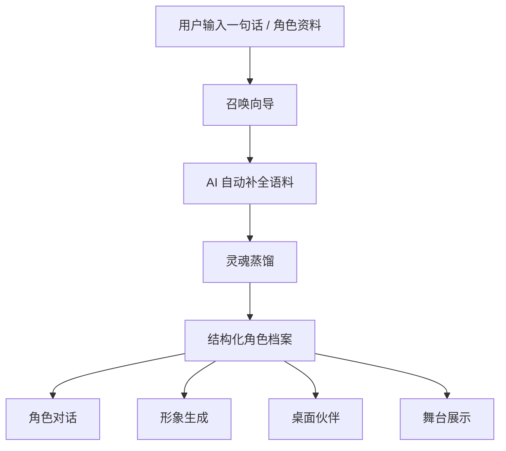

# Third Kind Contact / 英灵殿

<p align="center">
  
</p>

<h3 align="center">一句话，复刻你喜欢人物的灵魂与形象</h3>

<p align="center">
  <strong>AI Character Studio · Soul Distillation · Visual Companion · Desktop Stage</strong>
</p>

<p align="center">
  <a href="#项目介绍">项目介绍</a> ·
  <a href="#部署文档">部署文档</a> ·
  <a href="#功能清单">功能清单</a> ·
  <a href="#产品截图">产品截图</a> ·
  <a href="#api-配置">API 配置</a> ·
  <a href="#english">English</a>
</p>

---

## 项目介绍

Third Kind Contact / 英灵殿是一款桌面端 AI 角色复刻工作室。你只需要输入一句话或一段角色资料，它就能帮助你提炼人物的性格、语言、思维方式与视觉形象，并把它召唤成可以聊天、可以生成形象、可以停留在桌面的 AI 伙伴。

它不是普通的提示词聊天壳，而是一套完整的角色生成流程：从角色设定、语料蒸馏、灵魂档案、形象生成，到桌面陪伴和舞台展示。

### 适合人群

- 想把喜欢的历史人物、小说角色、游戏角色复刻成 AI 伙伴的人。
- 正在创作小说、剧本、游戏、视觉企划，需要稳定角色人格与语言风格的创作者。
- 想研究“角色智能体”“人格建模”“桌面陪伴应用”的开发者。
- 需要一个本地优先、可自带模型 Key、可自由扩展的 AI 角色工作台的用户。

---

## 部署文档

本项目提供两种常用运行方式，请根据你的目标选择。

### 部署方式选择

| 部署方式 | 特点 | 适用场景 | 启动命令 | 配置要求 |
| --- | --- | --- | --- | --- |
| Web 预览模式 | 启动快，便于调试 UI 和角色流程 | 开发、截图、快速体验 | `npm run dev` | Node.js 18+ |
| 桌面应用模式 | 完整 Tauri 桌面体验，支持窗口、桌面陪伴和本地能力 | 真实使用、桌面端测试、打包前验证 | `npx tauri dev` | Node.js 18+、Rust、Tauri 依赖 |
| 构建发行版 | 生成可分发桌面安装包 | 发布、演示、归档 | `npm run build` + `npx tauri build` | 完整 Tauri 构建环境 |

### 快速启动

```bash
git clone https://github.com/zhangtianruiwork-droid/Third-Kind-Contact.git
cd Third-Kind-Contact
npm install
```

启动 Web 预览：

```bash
npm run dev
```

打开：

```text
http://localhost:5173
```

启动桌面版：

```bash
npx tauri dev
```

构建发行版：

```bash
npm run build
npx tauri build
```

### 推荐使用流程


### 常见问题

| 问题 | 处理方式 |
| --- | --- |
| 不填 API Key 能否使用？ | 可以浏览界面和管理本地角色，但灵魂蒸馏、对话、形象生成等模型能力需要你自己的 API Key。 |
| Web 模式和桌面模式有什么区别？ | Web 模式适合调试和预览；桌面模式提供完整 Tauri 窗口、本地能力和桌面陪伴体验。 |
| 角色数据保存在哪里？ | 默认保存在本机 localStorage / Tauri 本地数据目录中。 |
| 是否内置模型服务？ | 不内置。项目使用“自带 Key”的方式接入兼容 API。 |

---

## 功能清单

### 已实现

| 功能模块 | 描述 |
| --- | --- |
| 英灵选择殿 | 管理、选择、导出角色档案，展示头像、标签、身份和配置状态 |
| 召唤向导 | 通过姓名、时代、简介和语料创建新角色 |
| 灵魂蒸馏 | 自动提炼核心性格、语言风格、心智模型和互动方式 |
| 角色对话 | 与召唤后的角色持续对话，并保留本地会话记录 |
| API 设置 | 支持 DeepSeek-compatible、OpenAI-compatible、Ark / Seedance 等接口配置 |
| 形象生成 | 支持头像、像素形象和角色视觉资产生成 |
| 桌面伙伴 | 将角色以桌面陪伴形式运行，增强沉浸感 |
| 舞台工具 | 支持桌面舞台、场景资产和可选视频生成工作流 |
| 本地存储 | 角色、设置、会话、形象和场景默认保存到本机 |
| 导入导出 | 支持角色数据导出，便于备份和迁移 |

### 功能流程图



### 模块能力概览

| 模块 | 输入 | 输出 | 依赖 |
| --- | --- | --- | --- |
| 角色创建 | 名称、时代、简介、语料 | 角色基础档案 | 本地存储 |
| 灵魂蒸馏 | 人物资料、文本语料 | 性格、语言、心智模型 | DeepSeek-compatible API |
| 对话陪伴 | 用户消息、角色档案 | 角色回复、会话记录 | Chat API |
| 形象生成 | 角色设定、风格提示 | 头像 / sprite / 视觉资产 | OpenAI-compatible Image API |
| 桌面舞台 | 角色、形象、场景设定 | 桌面陪伴体验 | Tauri 桌面能力 |

---

## 产品截图

### 英灵选择殿

管理你创建的角色，查看身份、标签、形象和配置状态。


### 灵魂蒸馏结果

将输入语料转化为结构化人格：核心性格、语言风格、心智模型与互动方式。


### 召唤仪式

从基础信息到语料补全，再到灵魂蒸馏和确认召唤，完整生成一个可使用的角色。


---

## API 配置

打开应用右上角设置面板，填入你自己的模型 Key。

| Provider | 用途 |
| --- | --- |
| DeepSeek-compatible API | 灵魂蒸馏与角色对话 |
| OpenAI-compatible Image API | 头像 / 像素形象生成 |
| OpenAI-compatible Search API | 可选检索增强 |
| Volcengine Ark / Seedance | 可选桌面舞台视频生成 |

应用不托管你的 API Key，不提供任何第三方模型服务担保。请自行选择服务商，并遵守其服务条款。

---

## 项目结构

```text
src/
  SelectionApp.tsx        英灵选择殿
  PetApp.tsx              桌面伙伴模式
  pages/SummonPage.tsx    召唤向导
  pages/SpriteGenPage.tsx 像素形象生成
  pages/SceneGenPage.tsx  舞台视频工具
  lib/                    API、存储、导入导出逻辑

src-tauri/
  src/lib.rs              Tauri 后端命令

docs/screenshots/         README 展示素材
```

---

## 安全与隐私

角色档案、设置、形象、场景和聊天记录默认保存在本机。只有当你主动触发需要模型能力的功能时，应用才会调用外部 API。

本仓库为公开源码版本，不包含内置 API Key、私有角色档案或个人生成素材。请不要将真实密钥提交到仓库。

---

## English

Third Kind Contact is a desktop AI character studio built with Tauri and React. Give it a short prompt or source material, and it helps you turn a character into a structured AI persona with personality, speech style, mental models, visual identity, and optional desktop companion behavior.

### Deployment

| Mode | Best For | Command |
| --- | --- | --- |
| Web preview | UI testing and quick screenshots | `npm run dev` |
| Desktop app | Full Tauri desktop experience | `npx tauri dev` |
| Release build | Packaging and distribution | `npm run build` + `npx tauri build` |

### Feature List

- Herald Registry for character profile management.
- Summoning wizard for creating new personas.
- Soul distillation for traits, speech style, mental models, and interaction rules.
- Local conversation history.
- Avatar and pixel companion generation.
- Desktop companion and stage workflow.
- Bring-your-own compatible model APIs.

### Development

```bash
git clone https://github.com/zhangtianruiwork-droid/Third-Kind-Contact.git
cd Third-Kind-Contact
npm install
npm run dev
```

Desktop mode:

```bash
npx tauri dev
```

---

## License

MIT. See [LICENSE](LICENSE).
